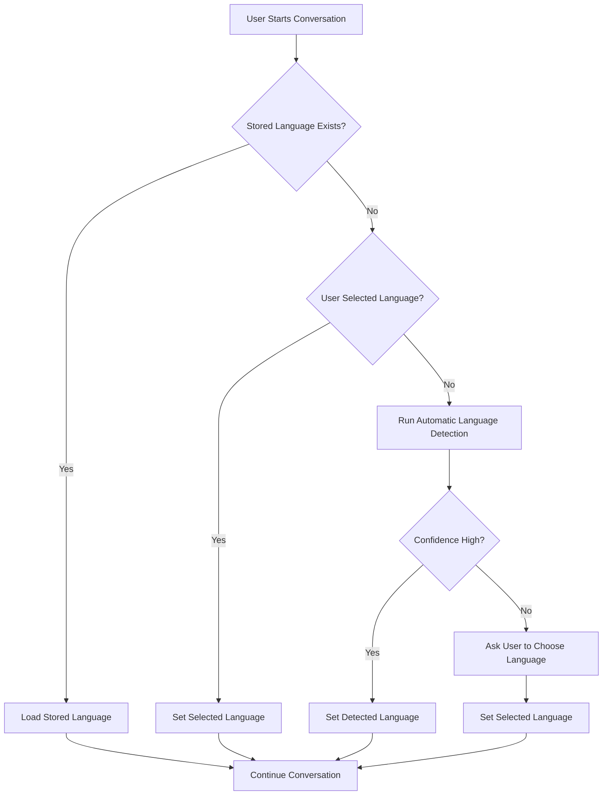
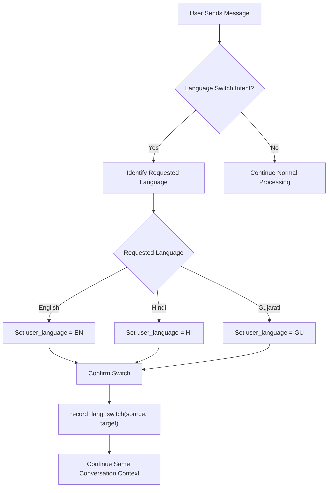
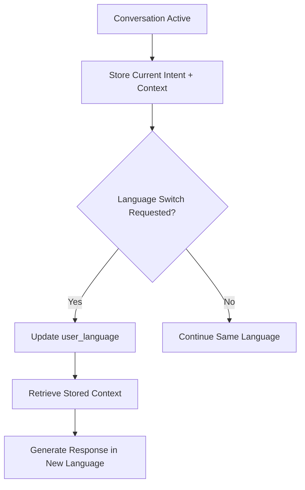
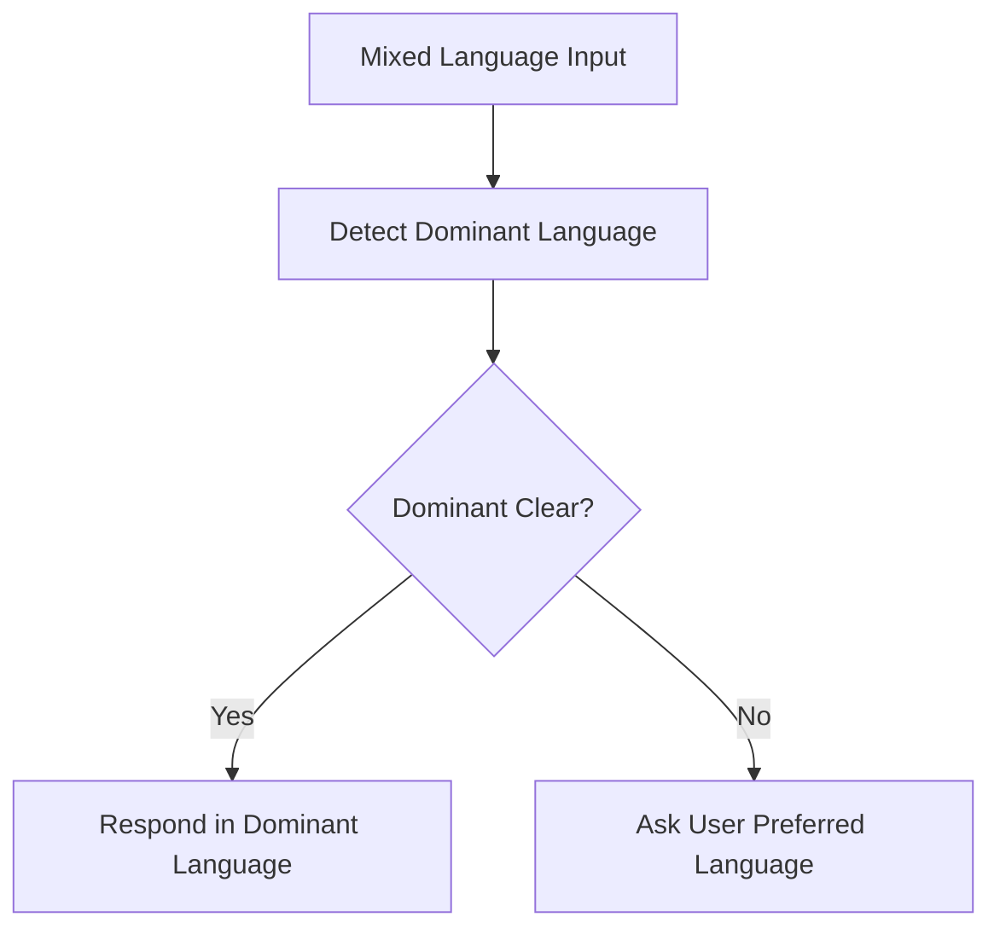
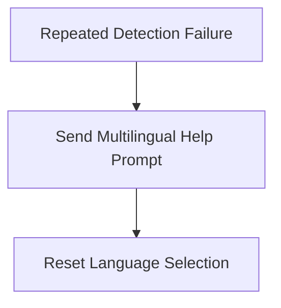

# Nikita Pal — Localization Decision Trees
## JKYog WhatsApp Bot

This document defines how the JKYog WhatsApp Bot handles multilingual interaction across:

- English (EN)
- Hindi (HI)
- Gujarati (GU)

The design ensures that the bot can detect user language, allow language switching during conversation, and preserve context when switching occurs.

---

# 1. Language Detection Logic

The first responsibility of the localization system is to identify the user's preferred language before generating responses. This is important because the JKYog WhatsApp Bot serves users with different linguistic backgrounds, and the first response often determines whether the user feels comfortable continuing the interaction.

The bot should follow a priority-based detection strategy:

1. Check whether the user already has a previously stored language preference.
2. If no stored preference exists, check whether the user explicitly selected a language from the welcome menu.
3. If neither exists, run automatic language detection on the first user message.
4. If confidence is low, request manual language selection.

This layered approach ensures both accuracy and user control.

The bot first determines which language the user prefers before generating responses.

The language can be identified using:

- Explicit user selection
- Automatic detection from first message
- Stored previous preference

## Decision Tree: Language Detection



## Detection Rules

If user explicitly selects:

```text
1 → English
2 → Hindi
3 → Gujarati
```

The bot stores:

```text
user_language = selected_language
```

If confidence is low, the bot asks the user to choose manually.

---

# 2. Switching Mechanisms (EN / HI / GU Transitions)

Users may begin in one language and later request another language depending on comfort, clarity, or who is using the phone. Therefore, the bot must support dynamic language switching without restarting the conversation.

The switching system should detect both direct commands and natural language requests. Examples include explicit commands such as "Switch to Hindi" as well as short language-only inputs like "ગુજરાતી".

When a switch is detected, only the language layer changes. The active conversation state, current intent, and previously collected information remain unchanged.

The bot allows language switching during conversation without interrupting flow.

## Supported Commands

- Switch to Hindi
- ગુજરાતી
- English please
- Change language

## Decision Tree: Language Switching



## Language Switch Logging

Each time a user changes language, the system records the transition for reporting and analytics.

Example:

```text
record_lang_switch(source, target)
```

This allows reporting on:

- most common language transitions
- preferred language over time
- multilingual engagement trends for JKYog users

Examples:

```text
record_lang_switch(EN, HI)
record_lang_switch(HI, GU)
record_lang_switch(GU, EN)
```

This information can help the JKYog board understand language usage patterns and improve multilingual support.

## Confirmation Examples

English:

```text
Your language has been switched to English.
```

Hindi:

```text
आपकी भाषा हिंदी में बदल दी गई है।
```

Gujarati:

```text
તમારી ભાષા ગુજરાતી માં બદલી દેવામાં આવી છે।
```

---

# 3. Context Preservation Across Language Switches

A critical requirement of multilingual conversational UX is that changing language should not reset the conversation. Users often ask a question in one language and request continuation in another language. The bot must preserve conversational memory while only translating the response layer.

The system therefore stores intent separately from language. Language becomes a presentation layer, while intent remains part of the active dialogue state.

For example, if the user is asking about temple timings, donation methods, or directions, that intent remains active even after language switching.

Language switching should not reset conversation state.

The bot preserves:

- current topic
- previous intent
- pending question
- user context

## Example

```text
User: Temple timings?
Bot: Temple opens at 9 AM.

User: हिंदी में बताओ
Bot: मंदिर सुबह 9 बजे खुलता है।
```

## Decision Tree: Context Preservation



## Stored Context Example

```text
current_intent = temple_timings
user_language = Hindi
previous_question = Temple timings
```

---

# 4. Mixed Language Handling

In real WhatsApp conversations, many users naturally mix languages within one sentence. This is especially common among bilingual users.

Examples include:

- Mandir directions chahiye
- Donation ka link bhejo
- Temple timings batao

The bot should not fail in these cases. Instead, it should identify the dominant language based on script, keywords, and sentence structure.

If one language is clearly dominant, the response should continue in that language. If ambiguity remains, the bot should request clarification.

Users may mix languages in one sentence.

Example:

```text
Mandir directions chahiye
```

## Decision Logic



---

# 5. Error Recovery

Error recovery is necessary when language detection repeatedly fails or when unsupported input is received.

Examples include:

- only emojis
- extremely short replies
- mixed unsupported scripts
- unclear abbreviations

In these cases, the bot should avoid making assumptions and instead present a multilingual fallback menu.

This ensures the conversation remains accessible rather than ending in confusion.

If language detection repeatedly fails:



## Recovery Message

```text
Please choose your language:
1️⃣ English
2️⃣ हिंदी
3️⃣ ગુજરાતી
```

---

# 6. Summary

The localization decision tree is designed to make multilingual interaction natural, flexible, and reliable for temple visitors using the JKYog WhatsApp Bot.

The design separates three major responsibilities:

- identifying language accurately
- allowing smooth language transitions
- preserving context independently of language

This approach ensures that multilingual support behaves like a real conversational assistant rather than a simple translation system.

This localization design ensures:

- accurate language detection
- smooth EN / HI / GU switching
- preserved conversation context
- stable multilingual UX for temple visitors

