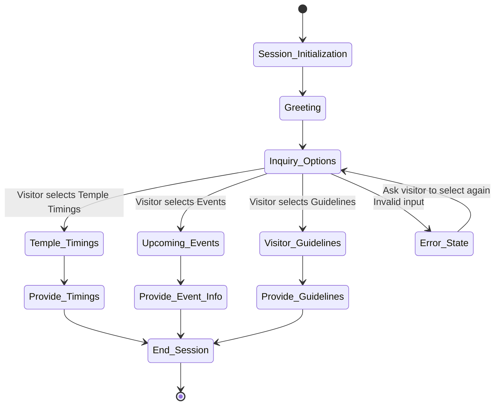
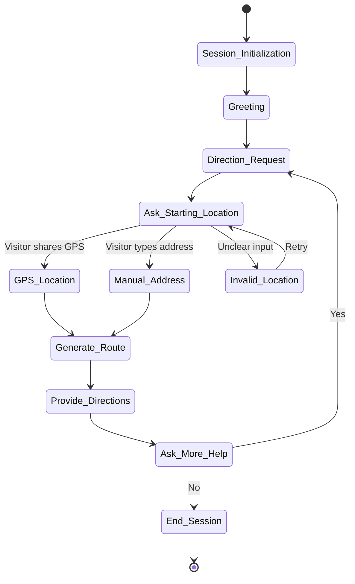

# JKYog Chatbot Conversation Flowcharts
Author: Ananth Vangala

These state machine diagrams represent the chatbot conversation flows for the JKYog temple visitor support system.

---

# Visitor Inquiry Flow — State Machine Diagram

This diagram represents the chatbot state machine for handling visitor inquiries for the JKYog temple.  
The flow includes session initialization, visitor options, responses, and error handling.



---

# Temple Directions Flow — State Machine Diagram

This diagram models how the chatbot assists visitors in getting directions to the temple.  
It handles location input, route generation, and error handling.



---

# Donation Request Flow — State Machine Diagram

This diagram represents how the chatbot assists users in making donations.  
It includes donation options, payment processing, confirmation, and error handling.

```mermaid
stateDiagram-v2

[*] --> Session_Initialization

Session_Initialization --> Greeting

Greeting --> Donation_Intent

Donation_Intent --> Provide_Donation_Options

Provide_Donation_Options --> Online_Donation : Donate Online
Provide_Donation_Options --> Temple_Donation : Donate at Temple
Provide_Donation_Options --> Invalid_Selection : Unclear input

Online_Donation --> Payment_Gateway

Payment_Gateway --> Payment_Success : Payment Approved
Payment_Gateway --> Payment_Failure : Payment Failed

Payment_Failure --> Retry_Payment : Retry
Retry_Payment --> Payment_Gateway

Temple_Donation --> Provide_Temple_Details

Invalid_Selection --> Provide_Donation_Options : Retry

Payment_Success --> Confirmation_Message
Provide_Temple_Details --> Confirmation_Message

Confirmation_Message --> Ask_More_Help

Ask_More_Help --> Donation_Intent : Yes
Ask_More_Help --> End_Session : No
